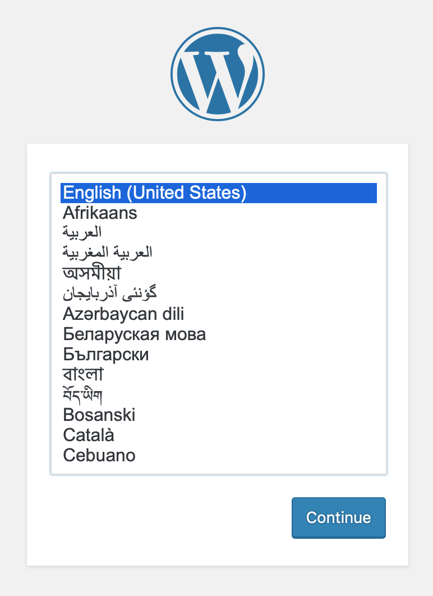

# Welcome To The Workshop!

## Introduction

This Git repo - and these instructions - are for my K3S workshop at DevFest Cymru 2019.

They assume you already have a working VM locally running Ubuntu 18.04 LTS, _or_ a cheap VPS hosted somewhere.

All the instructions are written for Ubuntu 18.04.3 LTS, as of November 6th, 2019. If you're running a different Linux distribution, it's on you to translate the instructions to suit.

There is a `Vagrantfile` provided in this Git repo, and that's what Stuart is running on his laptop during this workshop. If you're having problems with the VM or VPS you've brought to the workshop, and you're used to working with Vagrant, you're very welcome to give it a try - but don't be surprised if the venue's WiFi or broadband can't cope if everyone tries it at once :)

## How Can We Help?

If you've come across this repo in the future, Kubernetes et al has probably moved on a bit, and these instructions are probably somewhat out-of-date. If you are interested in using K3S to run containers in prod on cheap VPS's, why not hire us to help you do so? Send an email to Stuart at `hello@ganbarodigital.com` to start the conversation :)

## Table of Contents <!-- omit in toc -->

- [Introduction](#introduction)
- [How Can We Help?](#how-can-we-help)
- [Step 0: Prep](#step-0-prep)
  - [Introduction](#introduction-1)
  - [0a. Create Somewhere To Work](#0a-create-somewhere-to-work)
  - [0b. Install Operating System Tools](#0b-install-operating-system-tools)
  - [0c. Clone This Git Repo](#0c-clone-this-git-repo)
- [Step 1: Install And Run K3S](#step-1-install-and-run-k3s)
  - [1a. Install Docker](#1a-install-docker)
  - [1b. Test That Docker Is Working](#1b-test-that-docker-is-working)
  - [1c. Download K3S](#1c-download-k3s)
  - [1d. Start K3S](#1d-start-k3s)
  - [1e. Download kubectl](#1e-download-kubectl)
  - [1f. Copy kubectl Config File](#1f-copy-kubectl-config-file)
  - [1g. Setup Bash Completion](#1g-setup-bash-completion)
  - [1h. Prove kubectl Is Working](#1h-prove-kubectl-is-working)
- [Step 2: First Website: Wordpress](#step-2-first-website-wordpress)
  - [Underlying Principle: Local Storage](#underlying-principle-local-storage)
  - [2a. Create The Storage For MySQL](#2a-create-the-storage-for-mysql)
  - [2b. Install MySQL For Wordpress](#2b-install-mysql-for-wordpress)
  - [2c. Test MySQL](#2c-test-mysql)
  - [Underlying Principle: Port Forwarding Creates Security Issues](#underlying-principle-port-forwarding-creates-security-issues)
  - [2d. Remove MySQL Port Forwarding](#2d-remove-mysql-port-forwarding)
  - [2e. Create The Storage For Wordpress](#2e-create-the-storage-for-wordpress)
  - [2f. Install Wordpress](#2f-install-wordpress)
  - [2g. Testing Wordpress](#2g-testing-wordpress)
- [Step 3: Firewalls Are A Must-Have](#step-3-firewalls-are-a-must-have)
  - [3a. Install A Firewall](#3a-install-a-firewall)
  - [3b. Setup The Firewall Rules](#3b-setup-the-firewall-rules)
  - [3c. Switch On THe Firewall](#3c-switch-on-the-firewall)
- [Step 4: Adding Support For Multiple Websites](#step-4-adding-support-for-multiple-websites)
- [Step 5: Running Our Own Docker Images](#step-5-running-our-own-docker-images)
  - [Underlying Principle: Containers And Secure Registries aka Why Docker?](#underlying-principle-containers-and-secure-registries-aka-why-docker)

## Step 0: Prep

### Introduction

Before we get K3S up and running, there's some work to do to your VPS or VM.

### 0a. Create Somewhere To Work

SSH into your VPS (or open a Terminal window if you are working in a local VM) and run:

```bash
sudo su -
```

### 0b. Install Operating System Tools

You're going to need some CLI tools today.

```bash
apt-get install -y wget git
```

### 0c. Clone This Git Repo

Clone this Git repo:

```bash
# make sure you're in the right place
cd /root

# clone the repo
git clone https://github.com/ganbarodigital/k3s-devfest-workshop
```

The rest of these instructions assume that you've done these steps first :)

## Step 1: Install And Run K3S

### 1a. Install Docker

We're going to use Docker to run all of our containers.

* We'll configure K3S to use Docker as our preferred container engine.
* We'll use Kubernetes' standard CLI commands to start and stop containers.

Follow these steps to install Docker:

```bash
# make sure APT has everrything needed to support TLS
apt-get install -y apt-transport-https ca-certificates curl software-properties-common

# add the signing key for the Docker repo
curl -fsSL https://download.docker.com/linux/ubuntu/gpg | apt-key add -

# add the Docker repo
add-apt-repository \
   "deb [arch=amd64] https://download.docker.com/linux/ubuntu \
   $(lsb_release -cs) \
   stable"

# download the repo's package index
apt-get update

# install Docker
apt-get install -y docker-ce docker-ce-cli containerd.io
```

### 1b. Test That Docker Is Working

Now that Docker is installed, let's test it!

```bash
docker run hello-world
```

Docker will download the `hello-world:latest` image, and then print this message:

```
Hello from Docker!
This message shows that your installation appears to be working correctly.

To generate this message, Docker took the following steps:
 1. The Docker client contacted the Docker daemon.
 2. The Docker daemon pulled the "hello-world" image from the Docker Hub.
    (amd64)
 3. The Docker daemon created a new container from that image which runs the
    executable that produces the output you are currently reading.
 4. The Docker daemon streamed that output to the Docker client, which sent it
    to your terminal.

To try something more ambitious, you can run an Ubuntu container with:
 $ docker run -it ubuntu bash

Share images, automate workflows, and more with a free Docker ID:
 https://hub.docker.com/

For more examples and ideas, visit:
 https://docs.docker.com/get-started/
```

At this point, we're ready to get K3S up and running :)

### 1c. Download K3S

Download K3S by running:

```bash
# make sure you are in the right place
cd /root/k3s-devfest-workshop/step1-k3s

# download the binary
wget https://github.com/rancher/k3s/releases/download/v0.10.2/k3s

# make it executable
chmod 755 ./k3s
```

### 1d. Start K3S

```bash
# make sure you are in the right place
cd /root/k3s-devfest-workshop/step1-k3s

# start K3S manually
./start-k3s.sh
```

This will start the K3S server in the background, and write all of its log messages out to `./k3s.log`. You can use tools like `tail -f` to see what K3S is doing at any time.

In a production system, you'd setup K3S as a `systemd` service. There are plenty of instructions online on how to do that if you ever decide to go ahead and use K3S in anger.

### 1e. Download kubectl

```bash
wget https://storage.googleapis.com/kubernetes-release/release/v1.16.2/bin/linux/amd64/kubectl
chmod 755 ./kubectl
mv ./kubectl /usr/local/sbin
```

### 1f. Copy kubectl Config File

```bash
mkdir /root/.kube
cp /etc/rancher/k3s/k3s.yaml /root/.kube/config
```

### 1g. Setup Bash Completion

```bash
kubectl completion bash > /etc/bash_completion.d/kubectl
```

You'll need to log out of your current Terminal or SSH session to pick up the new completion rules.

### 1h. Prove kubectl Is Working

```bash
kubectl get pods --all-namespaces
```

You should see something like this:

```
NAMESPACE     NAME                                      READY   STATUS    RESTARTS   AGE
kube-system   coredns-57d8bbb86-rbjdq                   1/1     Running   0          14s
kube-system   local-path-provisioner-58fb86bdfd-zzwqh   1/1     Running   0          14s
```

The exact names will be different. Kubernetes generates unique, pseudo-random names for every 'pod' that you start.

## Step 2: First Website: Wordpress

For our first website, we're going to setup a vanilla Wordpress instance. And we're going to run it in a way that's equivalent to using Docker containers with port sharing.

__Don't do this in a production system.__ It's as flawed, insecure and downright dangerous as using Docker containers with port sharing.

It gives us a starting point that mimics what people actually do with Docker. It gives us something we can greatly - and easily - improve shortly :)

### Underlying Principle: Local Storage

In case you weren't aware - __always treat containers as READ-ONLY systems__. If they need to write data anywhere, you need to create some storage and mount it as a volume (or two) into the container.

With K3S, we do that by mounting a folder from your VM / VPS's filesystem into the container, using what is called Local storage.

* The folder has to exist on your VM / VPS's filesystem; Kubernetes will not create it for you.
* You have to use `nodeAffinity` in your _persistent volume_ config, otherwise Kubernetes will not allow you to mount the folder into your container.

We'll cover both of these in the steps below.

### 2a. Create The Storage For MySQL

Run this command:

```bash
# create the folder
mkdir -p /var/lib/k3s/default/wordpress-mysql-data
```

### 2b. Install MySQL For Wordpress

To install MySQL, we use the `kubectl` command to send some YAML configs up to Kubernetes. These configs describe our _desired state_. Kubernetes will then figure out what it needs to do to achieve what we've asked for - if it can.

```bash
# make sure you are in the right place
cd /root/k3s-devfest-workshop/step2-first-website/001-mysql

# edit the file 002-mysql-data-pv.yaml
#
# change the string 'ubuntu-bionic' to the hostname of
# YOUR VPS or VM
#
# if you forget to do this, your deployment will hang!

# send the MySQL objects to K3S
kubectl apply -f .
```

Kubernetes needs to go away and make all that happen. You can watch what is going on by running this command:

```bash
watch kubectl get pods
```

After a few minutes, you should see this:

```
NAME                READY   STATUS    RESTARTS   AGE
wordpress-mysql-0   1/1     Running   0          74s
```

When you do, MySQL is ready to test.

### 2c. Test MySQL

Connect to MySQL using the official CLI client:

```bash
# install a MySQL client
apt-get install -y mysql-client

# connect to the database
#
# when prompted, the password is 'password'
mysql -h 127.0.0.1 -P 30006 -u wordpress -p
```

Once you're in, you should see the following.

```
Welcome to the MySQL monitor.  Commands end with ; or \g.
Your MySQL connection id is 2
Server version: 5.7.28 MySQL Community Server (GPL)

Copyright (c) 2000, 2019, Oracle and/or its affiliates. All rights reserved.

Oracle is a registered trademark of Oracle Corporation and/or its
affiliates. Other names may be trademarks of their respective
owners.

Type 'help;' or '\h' for help. Type '\c' to clear the current input statement.

mysql>
```

You can type `show databases;` to see that we already have an empty `devfest` database, ready for Wordpress to populate.

```
mysql> show databases;

show databases;
+--------------------+
| Database           |
+--------------------+
| information_schema |
| devfest            |
+--------------------+
2 rows in set (0.02 sec)

mysql> quit
Bye
```

_Question: Why is it port 30006, and not the usual port of 3306?_

Kubernetes' port-forwarding uses a feature called _NodePorts_. By default, they are limited to the range 30000-32767 on the host machine. You can see the mapping in the YAML file [step2-first-website/001-mysql/006-mysql-nodeport.yaml](step2-first-website/001-mysql/006-mysql-nodeport.yaml).

### Underlying Principle: Port Forwarding Creates Security Issues

Btw, if you VM or VPS has a public IP address, right now _anyone_ can attempt to connect to MySQL on port 30006. Any port you open up like this is open to the world. That's how Kubernetes is designed and intended to work.

Port-forwarding is (mostly) a legacy feature - just like Docker's port-forwarding is. You can get away with it on a private machine, but it's best to learn safe habits as soon as possible, and to adopt those habits no matter where you are working.

Later on in the workshop, we'll install a basic firewall, both to prevent NodePorts being accessible from the Internet and to protect Kubernetes itself. But first, we need to get this first website up and running.

### 2d. Remove MySQL Port Forwarding

Even though it's on a non-standard port, we can't leave MySQL open like this. We've tested that MySQL is working. We don't need the port forwarding any more.

Run this command to delete the port-forwarding.

```bash
# this deletes the port-forwarding configuration
kubectl delete service wordpress-mysql-nodeport
```

If you try to access MySQL via the port-forwarding now:

```bash
mysql -h 127.0.0.1 -P 30006 -u wordpress -p
```

... you should see this error:

```
ERROR 2003 (HY000): Can't connect to MySQL server on '127.0.0.1' (111)
```

You can still access MySQL by using its Kubernetes Cluster IP:

```bash
mysql -h `kubectl get service wordpress-mysql -o jsonpath="{.spec.clusterIP}"` -u wordpress -p
```

### 2e. Create The Storage For Wordpress

The process for installing Wordpress is very similar to how we installed MySQL.

Wordpress needs somewhere to write the Wordpress PHP code (which it auto-updates) and any uploaded plugins, themes and media files.

Run this command:

```bash
# create the folder
mkdir -p /var/lib/k3s/default/wordpress-html
```

### 2f. Install Wordpress

Use `kubectl` to tell Kubernetes our _desired state_ for Wordpress:

```bash
# make sure you are in the right place
cd /root/k3s-devfest-workshop/step2-first-website/002-wordpress

# edit the file 002-wordpress-html-pv.yaml
#
# change the string 'ubuntu-bionic' to the hostname of
# YOUR VPS or VM
#
# if you forget to do this, your deployment will hang!

# send the Wordpress objects to K3S
kubectl apply -f .
```

Then watch as Kubernetes makes it happen:

```bash
watch kubectl get pods
```

You'll see something like this at first:

```
Every 2.0s: kubectl get pods                                                ubuntu-bionic: Wed Nov  6 10:53:07 2019

NAME                READY   STATUS              RESTARTS   AGE
wordpress-mysql-0   1/1     Running             0          100s
wordpress-tbbhz     0/1     ContainerCreating   0          32s
```

And once Kubernetes has finished doing everything, you'll see something like this:

```
NAME                READY   STATUS    RESTARTS   AGE
wordpress-mysql-0   1/1     Running   0          2m27s
wordpress-tbbhz     1/1     Running   0          79s
```

Once again, the exact names will be different. Kubernetes generates unique, pseudo-random names for every 'pod' that you start.

### 2g. Testing Wordpress

Point your web browser at the IP address of your VM or VPS. (If you are using the Vagrantfile in this Git repo, point your browser at `http://192.168.33.10`)

You should see the Install Wordpress screen:



